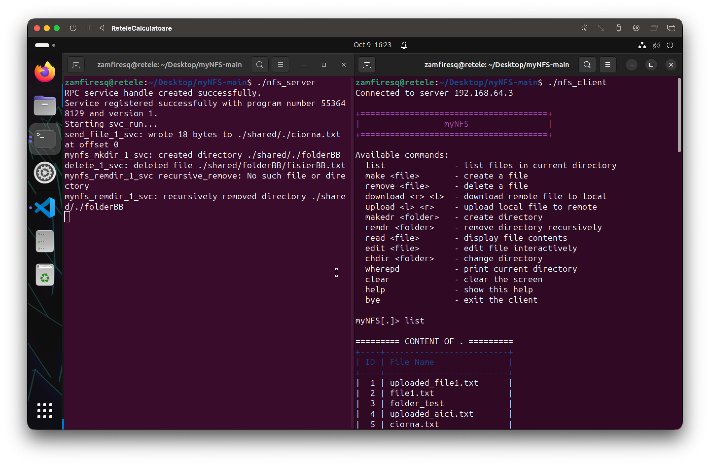

# myNFS

## Project Overview

**myNFS** is a lightweight implementation of a Network File System using **RPC** (Remote Procedure Call).
It allows remote file and directory operations on a server, accessible from a simple interactive client.

## Key Features
- RPC-based communication between client and server
- File & directory operations
- Interactive **edit/read** support
- `help` command with suggestions for unknown commands

### Dependencies

- **LibTIRPC**: The project uses libtirpc to implement the transport-independent RPC.
  - To install: `sudo apt-get install libtirpc-dev`
- **GCC** + **make**

### Compilation

To compile the NFS client:

```bash
gcc -g -o nfs_client nfs_client.c -ltirpc
```
To compile the NFS server:

```bash
gcc -g -o nfs_server nfs_server.c -ltirpc
```

Or:
```bash
make -f Makefile.nfs
```

### Usage
1. Start the NFS server:
   ```bash
   ./nfs_server
   ```
2. In another terminal, start the NFS client:
   ```bash
   ./nfs_client
   ```


